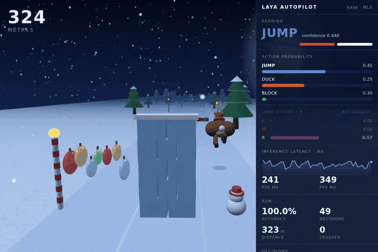
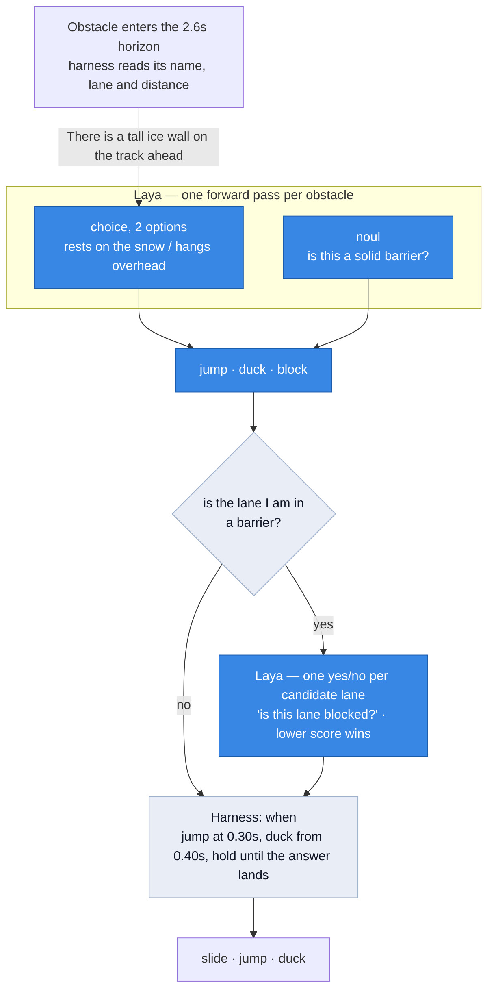

# Reindeer Jump, driven by Laya

> **An afternoon hack, written end to end by an LLM.** Every line here — code,
> measurements and this README — was produced by Claude Code in one session, with a
> human steering rather than checking. It is for learning what a small decision model
> can and cannot do, not for depending on.
>
> The numbers are real in that the scripts produce them and the recorded run is a real
> run, but they come from small samples against one model on one machine, and nothing
> has been independently verified or peer reviewed. Several figures in the git history
> were wrong and corrected later. Reproduce anything you intend to rely on — the eval
> scripts are here for exactly that — and treat the conclusions as observations rather
> than findings.

[Laya](https://github.com/NandhaKishorM/laya) is a 421M non-autoregressive decision
model: hand it a state and typed questions, and one forward pass returns calibrated
probabilities. No tokens are generated, so there is no JSON to repair and no parse step.

This repo containerises it and points it at a three-lane browser game, because a game
makes a wrong decision *visible* — the reindeer hits a wall — and grades itself, since
ground truth falls out of the game's own collision geometry.



*Every judgement here is the model's. It reads each obstacle as jumpable, duckable or an
impassable barrier, and rates the lanes when the one it is standing in is a barrier. The
harness handles timing, and picks between lanes the model rated equal. 150 decisions, no
misreadings, no crashes, 1117m. [Full recording](demo/run/run.webm).*

## Quick start

```bash
make up          # start the service (first run downloads ~1.7GB of weights)
make ready       # wait for the checkpoint to load
make test        # HTTP contract tests against the live model
make play        # the autopilot plays, and records video + a graded trace
```

On Apple silicon, skip Docker and use the MLX backend — about 30ms a decision against
940ms on CPU:

```bash
./scripts/serve-macos.sh
```

To watch it in a real browser rather than record it, serve the folder and open the page
with the autopilot enabled:

```bash
python3 -m http.server 8080
# http://localhost:8080/index.html?autopilot=1&laya=http://127.0.0.1:8000
```

## How a decision is made



Blue is the model, grey is the harness.

**The harness never overrides a lane the model picked.** It may notice that a change is
needed — the lane the reindeer occupies is one the *model* called a barrier — but the
destination is the model's answer, and the reindeer does not move while that answer is
in flight.

Where the model rates two lanes **equally**, it is because they hold the same thing, and
either is a correct answer. The harness then takes the nearer one, or the left one when both are
equally near — a timing choice among options the model has already called equivalent,
since a shorter slide spends less time straddling two lanes and a mistimed change is its
own way to die. In the recorded
run that was 3 of 12 lane questions, every one of them `duck`/`duck` or `clear`/`clear`.

Such a tie can never be between two barriers: the question only fires when the current
lane is a barrier, the generator guarantees a passable lane exists, so at most one of
the other two can be a barrier — and a barrier scores 1.0 while anything else scores
less. The count is in `summary.json` and flagged per trace row so the split is visible.

The two lanes it is not standing in are each scored by their own question — *"is this
lane blocked?"* against a description of that lane alone — and the lower score wins.
Leaving out the current lane is not the harness narrowing the choice: that lane having
been read as a barrier is the entire reason the question is being asked. The two that
remain are **not** filtered by what the model said about them; either may be a barrier
too, and picking one would be the model's mistake to make.

Comparing two numbers the model produced is arithmetic on its output, the same as
thresholding the barrier question at 0.5. It is not a preference the harness holds — the
*ordering* (a barrier is worse than a manoeuvre, which is worse than a clear lane) comes
entirely from the model and appears nowhere in the harness.

The harness also never reads the game's own obstacle class: `def.kind` appears in
`agent/autopilot.js` only for grading and logging. Everything it knows about passability
came from Laya. What it does read is each obstacle's name, lane and distance — the model
takes text, not pixels, so something has to say what is there.

## What the model is good at, and what it is not

**Classifying one described thing: essentially perfect.** In the recorded run it did not
misread a single obstacle. It is given only the object's name
(`There is a tall ice wall on the track ahead of the running reindeer.`) and works out
the rest.

| the run in `demo/` | |
|---|---|
| obstacles classified | **150**, accuracy **1.00** — jump 59/59, duck 52/52, block 39/39 |
| lane questions | **12, none chose a barrier** — 3 were ties between equivalent lanes |
| of those, chose a barrier | **0** |
| crashes | **0** |
| furthest run | **1117m** |

**Ranking described alternatives against each other: no better than chance.** This is why
the lane question is *not* asked as a choice between lanes. Offered a list, it answers by
option *position*. The clean test needs no baseline — ask the same two-option question
with the options swapped, and a model that is reading the state names the same lane
twice:

| pair, presented both ways | order-consistent |
|---|---|
| barrier vs clear | 0.10 |
| barrier vs jump | 0.20 |
| barrier vs duck, clear vs jump, clear vs duck, jump vs duck | 0.00 |

Swap the options and it names the other lane, even when one is a wall and the other is
empty. That table is the committed evidence, in `results/lane_forced.json`. An earlier
version of this agent did ask the lane question as a choice and took the first-listed
option on every lane change of a run, but that run is not retained, so treat the
swapped-order control above as the claim and the anecdote as colour.

**Asking one lane at a time fixes it,** because there is no list to prefer the front of.
Scored individually, the model's answer to *"is this lane blocked?"* comes out cleanly
ordered:

| lane contents | mean score |
|---|---|
| clear | **0.192** |
| needs a jump | 0.825 |
| needs a duck | 0.830 |
| barrier | **0.954** |

As a decision rule over pairs, across three different wordings of each content: it
**avoids the barrier in 26 of 27**, and prefers a clear lane to one needing a manoeuvre
**18 of 18** — which the choice framing never managed. `python -m eval.lane_forced`
reproduces both halves; `make eval` runs it alongside the
obstacle-classification sweep.

The general shape: **this model answers a question about one described thing, and cannot
rank several against each other.** That is how the obstacle classifier is built, it is
now how the lane question is built, and neither missed once in the recorded run.

## Three classes, two questions

Walls cannot be jumped or ducked, so the model has to separate three classes. The obvious
move — a third option — fails badly:

| framing | accuracy |
|---|---|
| **2-option choice + a `noul` barrier question** | **0.800** |
| two `noul` questions | 0.567 |
| one 3-option choice | 0.500 |

`choice3` answers "impassable" to nearly everything. **Option count is the sharpest edge
on this model**, so the third class gets its own question rather than a third label —
and since both questions ride in one forward pass, splitting costs nothing.
`python -m eval.obstacle_class` reproduces it, scoring each object under two phrasings.

The `noul` half is worth noting too: it is reliable for a sharp factual property ("is
this a solid barrier?") and unreliable for a graded one ("does this hang overhead?",
0.567). Use `choice` for the graded question and `noul` only for the crisp one.

## The game

Three lanes, obstacles that must be jumped or ducked, and ice walls that must be gone
around. Waves are **solvable by construction**: a wave picks its guaranteed-passable lane
out of the set still reachable in the time since the last wave, and refuses to wall it.

That is tested rather than asserted. `make solvable` runs a perfect rule-based player,
which reads the wave straight from game state and so cannot misclassify anything, for 400
waves. One such run — the mix varies run to run and tracks the generator's own
probabilities (40/40/20 walls, 47% with no clear lane); the zero does not vary:

```
waves survived : 400      walls per wave : 0:42%  1:40%  2:18%
distance       : 8653m    passable lanes : 1:18%  2:40%  3:42%
deaths         : 0        wholly clear   : 0:45%  1:41%  2:14%
```

Any death there is a generator bug, not a play error.

## Layout

```
index.html              the game; exposes window.__rj for automation
app/main.py             FastAPI service: /predict /healthz /readyz /info /presets
app/model.py            checkpoint loading; LAYA_BACKEND=auto picks MLX on Apple silicon
agent/autopilot.js      in-page agent: classifies, chooses, acts, grades itself
agent/hud.js            live telemetry panel
agent/play.mjs          Playwright driver: serves, injects, records, writes the trace
agent/check-page.mjs    verifies the ?autopilot=1 loader against a live service
agent/check-solvable.mjs  the solvability proof above
eval/runner.py          small HTTP client the evals share
eval/obstacle_class.py  how to separate three classes without a third option
eval/lane_choice.py     the lane question as a choice -- the framing that failed
eval/lane_forced.py     the swapped-order control, and the per-lane framing in use
scripts/serve-macos.sh  native Apple-silicon service, no Docker
scripts/introspect.py   print laya's real signatures after a version bump
tests/test_api.py       HTTP contract against a live model
demo/                   one recorded run: video, gif, trace, deaths, summary
classify/               part two: document classification, its own README and results
```

## Notes

- `LAYA_LOG_IO=compact` prints one line in and one line out per request, about 8µs each,
  so you can watch the traffic while it plays.
- To exercise the game and harness with no model at all, `make solvable` drives it with
  a rule-based player. There is deliberately no mock service: a second implementation of
  the request protocol drifted out of sync twice without failing, which is worse than
  not having one.
- `LAYA_SUBFOLDER` selects `multilingual` or `typed-decisions`; it works on both backends.
- GPU: build with `TORCH_INDEX=https://download.pytorch.org/whl/cu124` and uncomment the
  device reservation in `compose.yml`. `GET /info` reports the backend actually in use.
