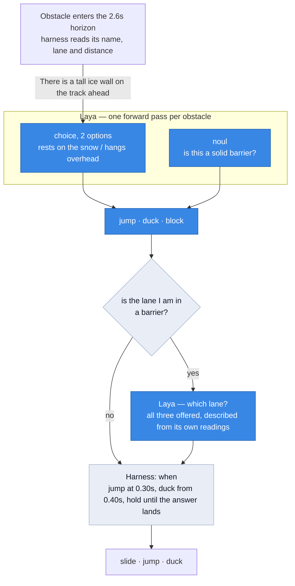

# Reindeer Jump, driven by Laya

[Laya](https://github.com/NandhaKishorM/laya) is a 421M non-autoregressive decision
model: hand it a state and typed questions, and one forward pass returns calibrated
probabilities. No tokens are generated, so there is no JSON to repair and no parse step.

This repo containerises it and points it at a three-lane browser game, because a game
makes a wrong decision *visible* — the reindeer hits a wall — and grades itself, since
ground truth falls out of the game's own collision geometry.


*Every decision here is the model's. It reads each obstacle as jumpable, duckable or an
impassable barrier, and when the lane it is standing in is a barrier it chooses where to
go. The harness only handles timing. [Full recording](demo/run/run.webm).*

## Quick start

```bash
make up          # start the service (first run downloads ~1.7GB of weights)
make ready       # wait for the checkpoint to load
make test        # HTTP contract tests against the live model
make play        # the autopilot plays, and records video + a graded trace
```

On Apple silicon, skip Docker and use the MLX backend — about 30ms a decision against
940ms on CPU:

```bash
./scripts/serve-macos.sh
```

To watch it in a real browser rather than record it, serve the folder and open the page
with the autopilot enabled:

```bash
python3 -m http.server 8080
# http://localhost:8080/index.html?autopilot=1&laya=http://127.0.0.1:8000
```

## How a decision is made



Blue is the model, grey is the harness.

**The harness never chooses a lane.** It may notice that a change is needed — the lane
the reindeer occupies is one the *model* called a barrier — but the destination is always
the model's answer, all three lanes are offered including the one being vacated, and the
reindeer does not move while the answer is in flight. If the model names a barrier, the
reindeer hits it.

The harness also never reads the game's own obstacle class: `def.kind` appears in
`agent/autopilot.js` only for grading and logging. Everything it knows about passability
came from Laya. What it does read is each obstacle's name, lane and distance — the model
takes text, not pixels, so something has to say what is there.

## What the model is good at, and what it is not

**Classifying one described thing: essentially perfect.** In the recorded run it did not
misread a single obstacle. It is given only the object's name
(`There is a tall ice wall on the track ahead of the running reindeer.`) and works out
the rest.

| the run in `demo/` | |
|---|---|
| obstacles classified | **130**, accuracy **1.00** — jump 44/44, duck 43/43, block 43/43 |
| lane choices made by the model | 10 |
| of those, it chose the barrier it was standing in | **5** |
| it took whichever lane was listed first | **90%** of the time |
| crashes | 4 |
| furthest run | 322m |

**Choosing between described alternatives: no better than chance.** Offered three lanes
whose contents are spelled out in the state, it answers by option *position*. The clean
test needs no baseline — ask the same two-option question with the options swapped, and a
model that is reading the state names the same lane twice:

| pair, presented both ways | order-consistent |
|---|---|
| barrier vs clear | 0.10 |
| barrier vs jump | 0.20 |
| barrier vs duck, clear vs jump, clear vs duck, jump vs duck | 0.00 |

Swap the options and it names the other lane, even when one is a wall and the other is
empty. `python -m eval.lane_forced` reproduces it.

That is the whole reason the reindeer still crashes. Reading obstacles is perfect and
every crash in the recording traces to the lane question — five of its ten answers named
the barrier the reindeer was already standing in.

It would be easy to hide this. Filtering the offered lanes down to ones the model has
already called safe takes the crash count to zero, because survival is then inherited
from the classifier upstream and the chooser cannot do any harm. That is not done here:
a component with no signal should not be made to look like one that works.

## Three classes, two questions

Walls cannot be jumped or ducked, so the model has to separate three classes. The obvious
move — a third option — fails badly:

| framing | accuracy |
|---|---|
| **2-option choice + a `noul` barrier question** | **0.800** |
| two `noul` questions | 0.567 |
| one 3-option choice | 0.500 |

`choice3` answers "impassable" to nearly everything. **Option count is the sharpest edge
on this model**, so the third class gets its own question rather than a third label —
and since both questions ride in one forward pass, splitting costs nothing.
`python -m eval.obstacle_class` reproduces it, scoring each object under two phrasings.

The `noul` half is worth noting too: it is reliable for a sharp factual property ("is
this a solid barrier?") and unreliable for a graded one ("does this hang overhead?",
0.567). Use `choice` for the graded question and `noul` only for the crisp one.

## The game

Three lanes, obstacles that must be jumped or ducked, and ice walls that must be gone
around. Waves are **solvable by construction**: a wave picks its guaranteed-passable lane
out of the set still reachable in the time since the last wave, and refuses to wall it.

That is tested rather than asserted. `make solvable` runs a perfect rule-based player,
which reads the wave straight from game state and so cannot misclassify anything, for 400
waves. One such run — the mix varies, the zero does not:

```
waves survived : 400      walls per wave : 0:39%  1:40%  2:22%
distance       : 8402m    passable lanes : 1:22%  2:40%  3:39%
deaths         : 0        wholly clear   : 0:52%  1:36%  2:12%
```

Any death there is a generator bug, not a play error.

## Layout

```
index.html              the game; exposes window.__rj for automation
app/main.py             FastAPI service: /predict /healthz /readyz /info /presets
app/model.py            checkpoint loading; LAYA_BACKEND=auto picks MLX on Apple silicon
agent/autopilot.js      in-page agent: classifies, chooses, acts, grades itself
agent/hud.js            live telemetry panel
agent/play.mjs          Playwright driver: serves, injects, records, writes the trace
agent/check-page.mjs    verifies the ?autopilot=1 loader against a live service
agent/check-solvable.mjs  the solvability proof above
eval/obstacle_class.py  how to separate three classes without a third option
eval/lane_choice.py     20 framings for the lane question, with constant baselines
eval/lane_forced.py     order-consistency: the control that needs no baseline
tests/test_api.py       HTTP contract against a live model
demo/                   one recorded run: video, gif, trace, deaths, summary
```

## Notes

- `LAYA_LOG_IO=compact` prints one line in and one line out per request, about 8µs each,
  so you can watch the traffic while it plays.
- `--mock` stands up a fake decision service with a known accuracy and latency, which
  exercises the whole rig without the model.
- `LAYA_SUBFOLDER` selects `multilingual` or `typed-decisions`; it works on both backends.
- GPU: build with `TORCH_INDEX=https://download.pytorch.org/whl/cu124` and uncomment the
  device reservation in `compose.yml`. `GET /info` reports the backend actually in use.
